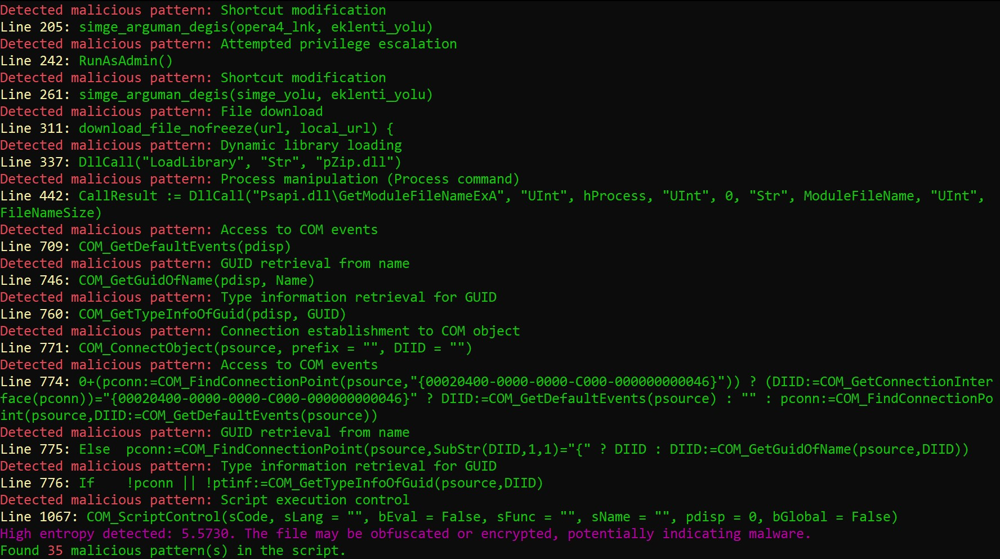

# VulneraKey

VulneraKey is a tool designed to identify potentially malicious patterns in AutoHotkey scripts.
It can to some degree detect obfuscated code by resolving variable assignments and executions.

## Requirements and Installation

- Python 3 is required

1. Clone this repository or download the script files.
2. Install the required library:

```
pip install -r requirements.txt
```

## CLI usage

To analyze a script file for malicious code and check for high entropy by default:

```
python main.py <file_path>
```

### Arguments

<file_path>: Path to the script file you want to analyze.

--entropy-threshold <threshold_value>: Set the threshold for entropy detection (with no value, default will be used).

--check-entropy: Enable entropy checking (default is enabled).

--no-check-entropy: Disable entropy checking.

## How It Works

1. **Entropy Checking**:

   - The tool calculates the entropy of the script content to assess the level of obfuscation or encryption.
   - The entropy level can be modified by the user.
   - A high entropy value may indicate that our "level of surprise" is high, meaning the script is obfuscated or encrypted, meaning the script is potentially malware.

2. **Variable Extraction and Replacement**:

   - The script first extracts variable assignments and identifies variable executions in the script.
   - It then replaces the executed variables with their actual values to reveal any obfuscated code.

3. **Malicious Code Detection**:
   - The modified script content is checked against a list of known malicious patterns.
   - Any detected patterns are highlighted and displayed in the console output.

#### Customization:

You can customize the malicious patterns by modifying the `patterns.json` file. Add or remove patterns as needed for your specific use case.

<div style="text-align: center;">
    
</div>

## Limitations

- For the moment, this script focuses on very simple obfuscation techniques and known malicious patterns. It may not detect more sophisticated code or new unknown patterns.
- False positives are more than likely to occur even when legitimate scripts use patterns similar to known malicious ones.
- The script does not perform dynamic analysis or executes the AHK code, which limits its ability to detect runtime malicious behavior.

## To Do

At this stage, this script is pretty basic, there is some major upgrades to be done to improve it. I might work on building some or all of those in the near future.

1. Decoding of malicious code that can be obfuscated with encoding methods such as base64 encoding that is available on AHK.

2. Eventually, to make this tool really effective, there's no escape from building an Abstract Syntax Tree to make the scan more efficient and thorough and to ensure the whole logic of the program is checked rather than just matching for patterns and.

3. Entropy is calculated to check for unusual randomness and complexity in the code. Since most AHK scripts are fairly simple, there usually isn’t much randomness or complexity. There’s still room to refine this approach for a more accurate evaluation.

## Contribution

Contributions to improve the script or expand the `patterns.json` database are welcome.

If you find a malicious script that `vulnerakey` doesn't recognize or have suggestions for improvements, please submit a pull request or open an issue to discuss proposed changes.
